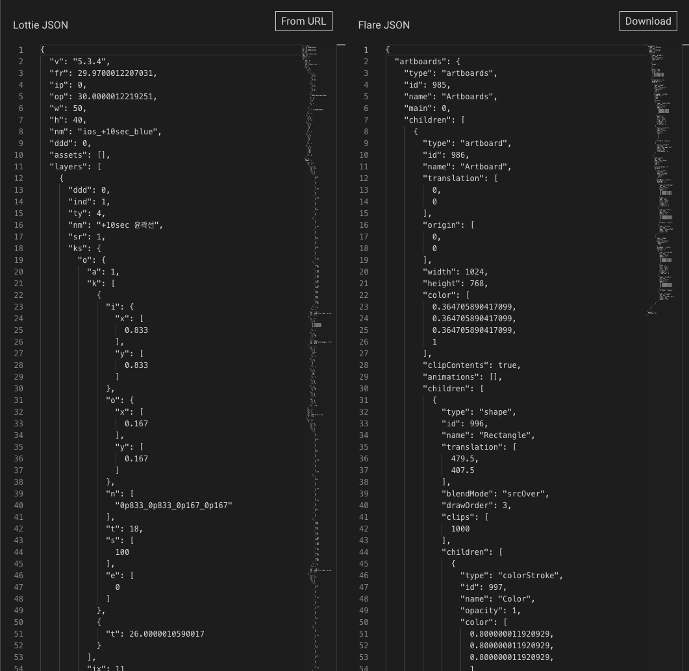

# Lottie To Flare
Converter from Lottie's Bodymovin JSON format to the Flare editor's file format. 

# NEW - Not functional yet!
Please note this is a work in progress, the tool is currently not functional as it spits out a known good Flare file for any input, but it is already stubbed out to do the Bodymovin parsing, conversion, and download of a valid flr2d file.

# Goal
Edit Lottie files in Flare and export them to Flutter or anywhere Flare runs. The code for the converter will be natively integrated into Flare so Lottie files can be directly dragged and dropped into Flare. 

# Converter Tool

This repository contains the converter code and a tool for debugging/testing the converter. This standalone tool is helpful for tracking down missing features and validating conversions. The tool allows the user to input JSON or link to a Lottie file. It generates the corresponding Flare editor JSON on the right. A download button is provided which will package the JSON as a flr2d file ready to be imported into Flare (just drag and drop the downloaded file over the Flare editor window). The resulting format is identical to what Flare uses internally (documentation will be provided).

[Try it out.](https://2d-inc.github.io/lottie_to_flare/)

# Flare Plugin
The plan is to have the converter integrated into Flare so you can directly drag & drop in a Lottie .json file and Flare will run this converter internally. We're publishing it as an open source project to allow the community to contribute directly to the converter. Help us add the features you want!

